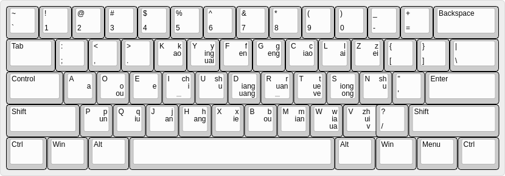

NEO KEYBOARD LAYOUT
===================

> Inspired by [German keyboard layout: NEO][neo-official]

**See <http://tangzhixiong.com/neo_keyboard_layout/>**.

## Windows

For Dvorak user: [neo.exe](https://github.com/district10/neo_keyboard_layout/blob/master/neo4win/neo.exe),
For QWERTY user, [spek.exe](https://github.com/district10/neo_keyboard_layout/blob/master/neo4win/spek.exe).

## macOS


Check out [neo4mac](neo4mac).
Also, see my karabiner configurations (dual-role keys) [here](https://github.com/district10/.karabiner).

## Linux

```
$cat dvorak
#!/bin/bash

xmodmap ~/git/neo_keyboard_layout/neo4linux/dvorak.xmodmap
pkill xcape; xcape -e 'Control_L=Escape'

$ cat qwerty
#!/bin/bash

xmodmap ~/git/neo_keyboard_layout/neo4linux/qwerty.xmodmap
```

```
Level 1, 2:

[             ] [             ] [             ] [             ] [             ] . [             ] [             ] [             ] [             ] [             ]
[      ;:     ] [      ,<     ] [      .>     ] [      kK     ] [      yY     ] . [      fF     ] [      gG     ] [      cC     ] [      lL     ] [      zZ     ]
[      aA     ] [      oO     ] [      eE     ] [      iI     ] [      uU     ] . [      dD     ] [      rR     ] [      tT     ] [      sS     ] [      nN     ]
[      pP     ] [      qQ     ] [      jJ     ] [      hH     ] [      xX     ] . [      bB     ] [      mM     ] [      wW     ] [      vV     ] [      /?     ]

Level 3:

[             ] [             ] [             ] [             ] [             ] . [             ] [             ] [             ] [             ] [             ]
[   <Insert>  ] [      "      ] [     <Up>    ] [      ]      ] [     <F2>    ] . [     <F11>   ] [       [     ] [       )     ] [      (      ] [      ~      ]
[   <Home>    ] [    <Left>   ] [    <Down>   ] [   <Right>   ] [    <END>    ] . [   <Delete>  ] [   <Return>  ] [     <Tab>   ] [   <Escape>  ] [      |      ]
[      '      ] [      {      ] [       -     ] [      _      ] [      }      ] . [ <Backspace> ] [       =     ] [       +     ] [       `     ] [      \      ]
```

|   Dvorak  |      左小     |      左无     |      左中     |      左食     |     左食      |     右食      |      右食     |      右中     |      右无     |      右小     |
| :-------- | :-----------: | :-----------: | :-----------: | :-----------: | :-----------: | :-----------: | :-----------: | :-----------: | :-----------: | :-----------: |
|     ＊    |       ＊      |       ＊      |       ＊      |  Upper Row    |       上行    |       ＊      |       ＊      |       ＊      |       ＊      |       ＊      |
|  L1 & L2  |      `;:`     |      `,<`     |      `.>`     |      `kK`     |      `yY`     |      `fF`     |      `gG`     |      `cC`     |      `lL`     |      `zZ`     |
|     L3    |   `<Insert>`  |      `"`      |     `<Up>`    |      `]`      |     `<F2>`    |     `<F11>`   |       `[`     |       `)`     |      `(`      |      `~`      |
|     ＊    |       ＊      |       ＊      |       ＊      |   Home Row    |       中行    |       ＊      |       ＊      |       ＊      |       ＊      |       ＊      |
|  L1 & L2  |      `aA`     |      `oO`     |      `eE`     |      `iI`     |      `uU`     |      `dD`     |      `rR`     |      `tT`     |      `sS`     |      `nN`     |
|     L3    |   `<Home>`    |    `<Left>`   |    `<Down>`   |   `<Right>`   |    `<END>`    |   `<Delete>`  |   `<Return>`  |     `<Tab>`   |   `<Escape>`  |      `|`      |
|     ＊    |       ＊      |       ＊      |       ＊      |   Lower Row   |       下行    |       ＊      |       ＊      |       ＊      |       ＊      |       ＊      |
|  L1 & L2  |      `pP`     |      `qQ`     |      `jJ`     |      `hH`     |      `xX`     |      `bB`     |      `mM`     |      `wW`     |      `vV`     |      `/?`     |
|     L3    |      `'`      |      `{`      |       `-`     |      `_`      |      `}`      | `<Backspace>` |       `=`     |       `+`     |    `` ` ``    |      `\`      |
|     ＊    |       ＊      |       ＊      |       ＊      |   L1 & L2     |      ＊       |       ＊      |       ＊      |       ＊      |       ＊      |       ＊      |
| Upper Row |      `;:`     |      `,<`     |      `.>`     |      `kK`     |      `yY`     |      `fF`     |      `gG`     |      `cC`     |      `lL`     |      `zZ`     |
| Home Row  |      `aA`     |      `oO`     |      `eE`     |      `iI`     |      `uU`     |      `dD`     |      `rR`     |      `tT`     |      `sS`     |      `nN`     |
| Lower Row |      `pP`     |      `qQ`     |      `jJ`     |      `hH`     |      `xX`     |      `bB`     |      `mM`     |      `wW`     |      `vV`     |      `/?`     |
|     ＊    |       ＊      |       ＊      |       ＊      |      L3       |       ＊      |       ＊      |       ＊      |       ＊      |       ＊      |       ＊      |
| Upper Row |   `<Insert>`  |      `"`      |     `<Up>`    |      `]`      |     `<F2>`    |     `<F11>`   |       `[`     |       `)`     |      `(`      |      `~`      |
| Home Row  |   `<Home>`    |    `<Left>`   |    `<Down>`   |   `<Right>`   |    `<END>`    |   `<Delete>`  |   `<Return>`  |     `<Tab>`   |   `<Escape>`  |      `|`      |
| Lower Row |      `'`      |      `{`      |       `-`     |      `_`      |      `}`      | `<Backspace>` |       `=`     |       `+`     |    `` ` ``    |      `\`      |

## Variations (svg images)

注：这些图已经 out dated 了，不具有参考性。以实际脚本和上面的表格为准。

Note: These svgs are out dated, and I do not use the third layout anymore
(I can't configure them on mac/win, so I focus on the first two layouts right
now instead of utilizing the third layout only on my ubuntu).

* neo-extended dvpe:
    + [L1][dvpe-L1]
    + [L2][dvpe-L2]
    + [L3][neo-L3]
* neo-extended dvp:
    + [L1][dvp-L1]
* neo-extended qwerty:
    + [L1][qwerty-L1]

## Advantages

* Life is really beautiful now!
* Emacs or Vim, we can use the same way to navigate, and actually it's system-widely usable

## What We get with the Fantastic Third Level

1. Move Cursor By One Char:
    * `Up`
    * `Down`
    * `Left`
    * `Right`
2. Move Cursor By Line:
    * `Home` (to beginning)
    * `End` (to end)
3. Move Cursor By Page:
    * `PageUp`
    * `PageDown`
4. `Return`, `Tab`, `Delete`, `BackSpace`, etc
5. Function keys: like `F11` (toggle full-screen)

## How to?

* run the specific script, and that's all
* if you want to make it permanent, add it to your `~/.xinitrc` or `~/.profile`
* and by the way, we need [xcape](https://github.com/alols/xcape), install that first, 在 [`xx-alols-xcape`](xx-alols-xcape) 文件夹下有安装说明。
* I use neo-extended dvpe.

## 双拼 Shuangpin Input Method

<http://www.keyboard-layout-editor.com>

[自然码](https://zh.wikipedia.org/wiki/%E8%87%AA%E7%84%B6%E7%A0%81)



check it out here: <https://github.com/district10/shuangpin-heatmap>

## [Roadmap](/roadmap.md)

[neo-official]: http://www.neo-layout.org/
[jianshu-blog]: http://jianshu.io/p/2f56bed65e5c
[dvpe-L1]: res/neo-dvpe-L1.svg
[dvpe-L2]: res/neo-dvpe-L2.svg
[dvp-L1]: res/neo-dvp-L1.svg
[dvp-L2]: res/neo-dvp-L2.svg
[qwerty-L1]: res/neo-qwerty-L1.svg
[qwerty-L2]: res/neo-qwerty-L2.svg
[neo-L3]: res/neo-L3.svg

## Website

* <http://district10.github.io/neo_keyboard_layout/>
* <http://tangzhixiong.com/dvorak-emulate/>
